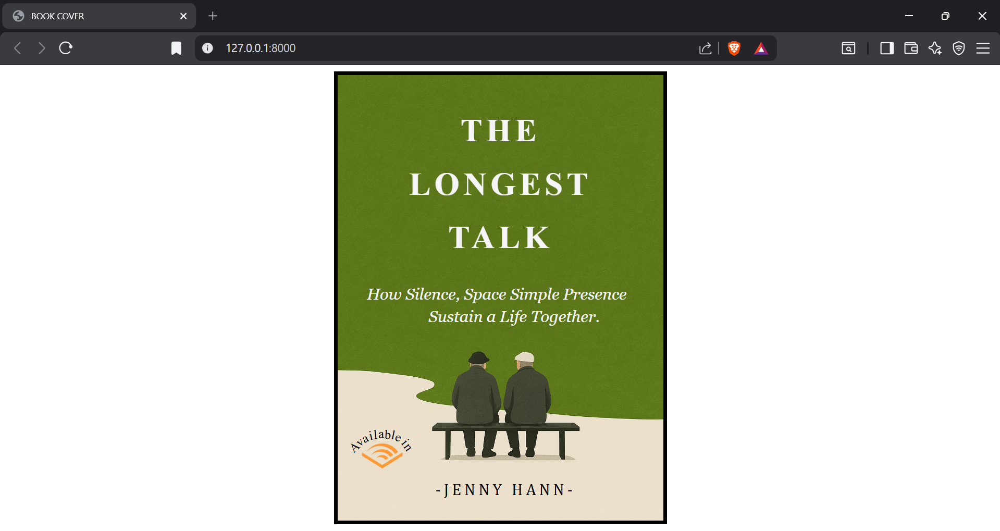

# Ex.06 Book Front Cover Page Design
# Date: 05.12.2025
# AIM:
To design a book front cover page using HTML and CSS.

# DESIGN STEPS:
## Step 1:
Create a Django Admin project.

## Step 2:
Create an app in the Django interface.

## Step 3:
Create a folder named 'static' in the app folder.

## Step 4:
Create a new HTML file in the static folder.

## Step 5:
Write the HTML code with relevant CSS properties.

## Step 6:
Choose the appropriate style and color scheme.

## Step 7:
Insert the images in their appropriate places.

## Step 8:
Publish the website in the LocalHost.

# PROGRAM:
urls.py
```
from django.contrib import admin
from django.urls import path
from coverpage import views

urlpatterns = [
    path('admin/', admin.site.urls),
    path('', views.bookcover),
]
```
views.py
```
from django.shortcuts import render

def bookcover(request):
    return render(request,'cover.html')
```
cover.html
```

<html lang="en">
    <head>
        <title>BOOK COVER</title>
        <style>
            .page{
                position:relative;
                background-image: url("");
                background-size: 100%;
                height:98%;
                width:33%;
                margin-left: auto;
                margin-right: auto;
                border: 5px solid black;
            }
            .page img{
                position:absolute;
                height: 8%;
                width:auto;
                top:81.5%;
                left:5.5%;
            }
            .page h1{
                text-align: center;
                font-size: 40px;
                line-height: 30px;
                color: whitesmoke;
                letter-spacing: 5px;
            }
            .page pre{
                position:absolute;
                bottom: 80%;
                left:9%;
                top:43%;
                line-height: 28px;
                font-size: 20px;
                font-style: italic;
                color: whitesmoke;
                font-family: Georgia, 'Times New Roman', Times, serif;
            }
            .page h2{
                position: absolute;
                bottom: 2%;
                left:30%;
                font-weight: lighter;
                font-size: 20px;
                font-family:Cambria, Cochin, Georgia, Times, 'Times New Roman', serif;
                letter-spacing: 4px;
            }
            .page span{
                position: absolute;
            }
        </style>
    </head>
    <body>
        <div class="page">
            <h1 style="padding-top: 27px;">THE</h1>
            <h1 style="padding-top: 10px;">LONGEST</h1>
            <h1 style="padding-top: 10px;">TALK</h1>
            
            <span style="transform: rotate(318deg);bottom: 83px;left:15px;">A</span>
            <span style="transform: rotate(323deg);bottom: 89px;left:24px;">v</span>
            <span style="transform: rotate(335deg);bottom: 93.8px;left:31px;">a</span>
            <span style="transform: rotate(347deg);bottom: 97px;left:39px;">i</span>
            <span style="transform: rotate(354deg);bottom: 98.6px;left:45px;">l</span>
            <span style="transform: rotate(360deg);bottom: 98.8px;left:51px;">a</span>
            <span style="transform: rotate(4deg);bottom: 98.5px;left:59px;">b</span>
            <span style="transform: rotate(12deg);bottom: 97.7px;left:67px;">l</span>
            <span style="transform: rotate(23deg);bottom: 95px;left:72.5px;">e</span>
            <span style="transform: rotate(51deg);bottom: 89px;left:82px;">i</span>
            <span style="transform: rotate(56deg);bottom: 83px;left:84.5px;">n</span>
            <pre>How Silence, Space Simple Presence
                Sustain a Life Together.         </pre>
            <h2>-JENNY HANN-</h2>
        </div>
    </body>
</html>
```
# OUTPUT:

# RESULT:
The program for designing book front cover page using HTML and CSS is completed successfully.
